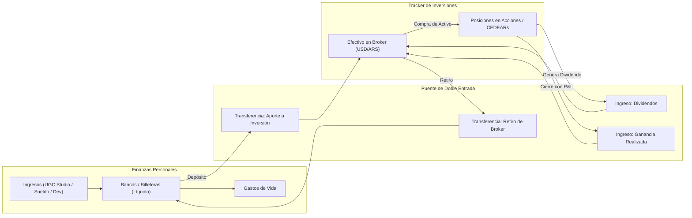

# Plan Maestro Definitivo: Integración de Finanzas Personales & Portfolio Tracker

**Plataforma:** Chess — Your Portfolio Strategy & Personal Wealth Engine  
**Versión:** 3.0 — Validado y Optimizado (/grill-me)  
**Fecha:** Agosto 2026  
**Alcance:** Finanzas Personales Puras + Tracker de Inversiones Bursátiles (Patrimonio Unificado)

---

## 1. Visión Ejecutiva y Filosofía de Diseño: Fricción Cero

### 1.1 La Tesis de la Economía Personal Unificada (Finanzas Personales + Inversiones)
El software integra los dos pilares fundamentales de la economía de un individuo:
1. **Finanzas Personales (Flujo de Caja):** Registro de ingresos personales (pagos de UGC Studio, desarrollos freelance de IA, sueldos, dividendos bursátiles) y gastos de vida (vivienda, comida, viajes, ocio, tecnología, salud).
2. **Inversiones (Acumulación de Capital):** Asignación del excedente de ahorro en activos productivos (Acciones, CEDEARs, Bonos, Cripto) con seguimiento de rendimiento y valor de mercado.

> **Definición de Alcance:** El módulo de finanzas es **100% PERSONAL**. Los costos operativos de empresas (publicidad, comisiones de closers, sueldos de creadores de agencias) no forman parte de este sistema. Los pagos o retiros de negocio ingresan estrictamente como **fuente de ingreso personal**.

```
┌─────────────────────────────────────────────────────────────────────────┐
│                    CHESS WEALTH & STRATEGY ENGINE                       │
│                                                                         │
│   ┌────────────────────────┐                   ┌────────────────────┐   │
│   │   FINANZAS PERSONALES  │                   │  PORTFOLIO TRACKER │   │
│   │  - Ingresos Personales │── Aportes/Cash ──>│ - Acciones / CEDEAR│   │
│   │  - Gastos de Vida      │<── Dividendos ────│ - Bonos & Cripto   │   │
│   │  - Medios de Pago / FX │<── Ventas P&L ────│ - Estrategias & P&L│   │
│   └───────────┬────────────┘                   └─────────┬──────────┘   │
│               │                                          │              │
│               └────────────────────┬─────────────────────┘              │
│                                    ▼                                    │
│                     DASHBOARD UNIFICADO (NET WORTH)                     │
│               Patrimonio Neto = Líquido + Invertido - Deudas            │
│               Savings Rate · Runway · Burn Rate · Aportes Broker        │
└─────────────────────────────────────────────────────────────────────────┘
```

---

### 1.2 Principio Rector: "Cargar > No Cargar"
El objetivo principal del software es **eliminar por completo la fricción de carga**.

| Prioridad | Principio | Implicancia Práctica en el Software |
| :--- | :--- | :--- |
| **1** | **Cargar > No cargar** | Ante cualquier ambigüedad, persistir con `confidence: 'low'` y `needs_review: true`. Jamás bloquear por falta de datos. |
| **2** | **Inferir > Preguntar** | Solo interrumpir al usuario si la inferencia produciría un error material (monto ilegible o medio desconocido). |
| **3** | **Guardado Inmediato + Cola Asíncrona** | Guardar siempre en DB emitiendo respuesta de 1 línea y encolar las transacciones dudosas en la **Cola de Revisión** (`needs_review`). |
| **4** | **Corregir después > Bloquear ahora** | Toda transacción es editable en **1 solo tap** desde la notificación, timeline o chat. |

#### Benchmarks de Velocidad
- **Screenshot de Comprobante:** `< 4 segundos`, **1 tap** (Compartir $\to$ Chess).
- **Texto Libre / Shorthand:** `< 3 segundos`, **1 mensaje** en Omnibar o Chat.
- **Batch de 60 Transacciones:** `< 30 segundos`, **1 paste** de texto o tabla.
- **Corrección Post-Carga:** `< 2 segundos`, **1 tap** en píldora interactiva.

---

## 2. Arquitectura de Navegación: Conmutación por Modo en Cabecera

Para mantener la claridad mental y una interfaz limpia sin sobrecargar el menú inferior móvil, la navegación se estructura mediante un **Selector de Modo en la Barra Superior**:

```
┌─────────────────────────────────────────────────────────────────────────┐
│  ♟ CHESS WEALTH           [ 💼 Inversiones  |  💳 Finanzas ]    USD/ARS │
└─────────────────────────────────────────────────────────────────────────┘
```

### 2.1 Modo Inversiones (Portfolio Tracker)
- **Vistas:** Tablero Principal (`/`), Registro de Trades (`/trades`), Análisis de Rendimiento (`/analysis`), Notación de Portfolio (`/portfolio`), Estrategia, Social y Chess AI.
- **Botón Central FAB:** Registrar nuevo Trade (Compra / Venta / Dividendo).

### 2.2 Modo Finanzas Personales (Cash Flow & Gastos)
- **Vistas:**
  1. 💸 **Flujo de Período (`/finance`):** Diagrama Sankey interactivo de ingresos y egresos.
  2. 📜 **Timeline de Movimientos (`/finance/timeline`):** Feed cronológico con edición inline, soft-delete y búsqueda full-text.
  3. 📊 **Métricas & Evolución (`/finance/analytics`):** Evolución temporal de gastos por categoría y medios de pago.
  4. 🏷️ **Categorías (`/finance/categories`):** Administrador de categorías, colores, iconos y keywords.
  5. 💳 **Medios de Pago (`/finance/payment-methods`):** Gestión de cuentas y patrones de detección OCR.
  6. 📥 **Cola de Revisión (`/finance/review`):** Triage rápido de transacciones con `needs_review: true`.
- **Botón Central FAB:** Ingesta Rápida (Shorthand, Nota de voz o Captura de comprobante).

---

## 3. Canales de Ingesta Fricción Cero

```
                      CANALES DE INGESTA FRICCIÓN CERO
                      
   [ 1. Web Share Target ]  ────────►  [ Screenshot de Mercado Pago, DolarApp, Banco ]
   [ 2. Floating Omnibar ]  ────────►  [ "Fútbol 12 usd", "Super 35.000 MP" ]
   [ 3. Chess AI Drawer  ]  ────────►  [ Chat persistente con audio y correcciones ]
   [ 4. Global Drop/Paste]  ────────►  [ Drag & drop de comprobantes o tablas markdown ]
                                       │
                                       ▼
                     ┌───────────────────────────────────┐
                     │      MOTOR DE INGESTA & VLM       │
                     │  (Gemini Flash + Heurísticas FX)  │
                     └─────────────────┬─────────────────┘
                                       │
                                       ▼
                     ┌───────────────────────────────────┐
                     │  RESPUESTA CONFIRMACIÓN DE 1 LÍNEA│
                     │  "✓ Edesur — $26.84 · House · MP" │
                     └───────────────────────────────────┘
```

### 3.1 PWA Web Share Target (Killer Feature)
1. Usuario saca captura de pantalla en Mercado Pago, DolarApp o app bancaria.
2. Presiona *Compartir* $\to$ selecciona *Chess*.
3. La PWA procesa en segundo plano con el VLM y emite notificación inmediata:  
   `"✓ Edesur — $26.84 (ARS 37.000 @ 1378.5) · House · Mercado Pago"`

### 3.2 Omnibar Global & Floating Dock
- **Desktop (`Cmd+K`):** Barra de comandos con parser en lenguaje natural y dropzone de portapapeles (`Ctrl+V`).
- **Mobile:** Dock flotante con botón de nota de voz (1 tap con transcripción IA), input telegráfico y cámara directa.

### 3.3 Chat Asistente Ubicuo
- Soporta inputs múltiples (*"Gimnasio 38k y viaje 73k"* $\to$ 2 gastos).
- Correcciones conversacionales post-carga (*"Pagué desde Mercado Pago"* $\to$ actualiza la anterior).
- Unificación y merge (*"Uní las dos últimas"*).

---

## 4. Pipeline de Extracción y Reglas de Negocio

### 4.1 Reglas de Exclusión Obligatorias
| Caso | Ejemplo Real | Acción del Motor |
| :--- | :--- | :--- |
| **Leg de Conversión DolarApp** | `USDc → ARS -57.76 USDc / +85,075 ARS` acompañando `DISCO -85,075 ARS` | **Excluir la conversión y el gasto duplicado en ARS**. Registrar solo el gasto real en USDc (**$57.76 USD**). |
| **Recarga de Saldo (Top-up)** | `Card payment +774.50 USDC` o `Ingreso de dinero MP` | **Excluir**. No es ingreso, es fondeo de billetera. |
| **Transacción Revertida** | `Het Zwarte Fietsenplan -250 EUR (Reverted)` | **Excluir automáticamente**. |
| **Transferencia Propia** | `Transferencia a cuenta propia` | **Excluir** o registrar como transferencia interna sin impacto en gastos. |
| **Duplicado PENDING / Settled** | Mismo monto y comercio pendiente y liquidado | **Deduplicar** manteniendo la versión liquidada. |
| **Mercado Pago "Dinero disponible"** | Comprobante que dice "Dinero disponible: $20.093,31" | **Interpretar como el monto pagado**, no como saldo. |
| **Mercado Libre Multi-Producto** | Compra con 1 Cargador ($49.339) + 1 Almohada ($48.499) | **Dividir en 2 transacciones** separadas: Tech ($33 USD) y House ($32 USD). |

### 4.2 Categorizador en Cascada de 3 Niveles
1. **Nivel 1 (Historial Exacto):** Si el comercio existe en transacciones previas del usuario $\to$ asigna categoría en 0ms con 100% de confianza.
2. **Nivel 2 (Keywords y Alias):** Coincidencia difusa con la lista de palabras clave de cada categoría (`"disco"`, `"coto"` $\to$ `Food`).
3. **Nivel 3 (Inferencia LLM):** Extracción contextual con Gemini. Si la confianza es media/baja, asigna la más probable y activa `needs_review: true`.

---

## 5. Visual Analytics & Diagrama de Flujo Personal (Sankey)

### 5.1 Diagrama Sankey de Flujo de Caja Personal ("FLUJO DEL PERÍODO")
El gráfico reproduce exactamente la estética dark theme con nodos codificados por color para la economía personal:

```
┌─────────────────────────────────────────────────────────────────────────────────────────────────────────┐
│ 💸 FLUJO DEL PERÍODO                                                                                     │
│ $12,480                                                                                                 │
│ De dónde entró cada peso y en qué se fue — Flujo de Caja Personal Consolidado                           │
├─────────────────────────────────────────────────────────────────────────────────────────────────────────┤
│                                                                                                         │
│  [ INGRESOS PERSONALES (VERDE) ]     [ CASH COLLECTED (BLANCO) ]      [ GASTOS DE VIDA (ROJO/CORAL) ]   │
│                                                                                                         │
│  Pago Mensual UGC Studio ────────┐                                ┌──► Vivienda / House ($1,850 · 14.8%)│
│  $8,500 · 68.1%                  │                                ├──► Supermercado / Food ($920 · 7.4%)│
│                                  │                                ├──► Viajes / Travel ($1,240 · 9.9%)  │
│  AI Dev Freelance ───────────────┼──► █ INGRESOS DISPONIBLES ─────┼──► Salidas & Ocio ($680 · 5.4%)     │
│  $2,500 · 20.0%                  │    █ $12,480                   ├──► Tech / Gadgets ($450 · 3.6%)     │
│                                  │    █                           ├──► Tools / Software ($180 · 1.4%)   │
│  Ventas Trading / P&L ───────────┤    █                           ├──► Servicios / Payments ($210 · 1.7%)│
│  $800 · 6.4%                     │    █                           └──► Salud / Healthcare ($140 · 1.1%) │
│                                  │    █                                                                 │
│  Dividendos Portfolio ───────────┤    █                           [ AHORRO & INVERSIÓN (VIOLETA) ]      │
│  $450 · 3.6%                     │    █                                                                 │
│  Venta de Usados ($230 · 1.8%) ──┘    █                           ┌──► Aportes al Broker (Acciones/ETFs)│
│                                       └───────────────────────────┤    $5,000 · 40.1%                   │
│                                                                   └──► Liquidez en Cuentas / Colchón    │
│                                                                        $1,310 · 10.5%                   │
└─────────────────────────────────────────────────────────────────────────────────────────────────────────┘
```

#### Codificación Cromática:
- **Verde Esmeralda (`#10b981`):** Fuentes de ingreso personal.
- **Blanco / Slate (`#f8fafc`):** Nodo central de liquidez recaudada (*Cash Collected*).
- **Rojo Coral (`#f43f5e`):** Gastos de vida categorizados.
- **Violeta Neón (`#a855f7`):** Excedente de ahorro inyectado al **Portfolio de Inversiones Bursátiles** y colchón bancario.

### 5.2 Visualización Multimoneda
- **Moneda Base:** USD para todas las métricas históricas sin distorsión inflacionaria.
- **Selector Rápido USD / ARS:** Conmuta todos los gráficos al tipo de cambio Dólar Cripto / MEP en 1 tap.

### 5.3 Evolución Temporal de Gastos
- Gráfico de barras apiladas mensuales para ver el comportamiento histórico de cada categoría.
- Líneas de tendencia y detección de anomalías por IA (*"En Julio, Travel aumentó 2.8x por viaje a Europa"*).

---

## 6. Gestión Dinámica de Categorías y Medios de Pago

### 6.1 Panel de Categorías (`/finance/categories`)
- **CRUD Visual:** Nombre, Icono (Lucide), Color HEX.
- **Editor de Keywords y Alias:** Permite al usuario entrenar el matcher local agregando sinónimos.
- **Auto-Generación Sugerida (1-Tap):** Si la IA detecta un concepto nuevo recurrente (ej. *"Veterinaria"*), propone la categoría con icono y color preconfigurados en la tarjeta de revisión, sin crearla silenciosamente.

### 6.2 Panel de Medios de Pago (`/finance/payment-methods`)
- **Gestión de Cuentas:** DolarApp Global Card, Mercado Pago, Bank ARS, Bank USD, Mercury, Payoneer, Efectivo, Cripto.
- **Editor de Patrones OCR:** Regex y encabezados para auto-detección en screenshots (`"MERPAGO*"`, `"Dinero disponible"`, `"USDc"`, `"ARQ"`).
- **Analítica por Medio de Pago:** Gráfico Donut de gasto por tarjeta y control de flujo de caja.

---

## 7. Integración Cruzada con Inversiones & Net Worth



### Fórmulas Financieras
1. **Patrimonio Neto (Net Worth):**
   $$\text{Net Worth} = \sum \text{Efectivo Líquido} + \sum \text{Efectivo en Broker} + \sum \text{Valor de Mercado Inversiones} - \sum \text{Deudas}$$
2. **Tasa de Ahorro:** $\text{Savings Rate} = \frac{\text{Ingresos} - \text{Gastos}}{\text{Ingresos}} \times 100$
3. **Tasa de Inversión:** $\text{Investment Rate} = \frac{\text{Aportes Netos a Broker}}{\text{Ingresos}} \times 100$
4. **Runway Total:** $\text{Runway} = \frac{\text{Efectivo Líquido} + \text{Inversiones Líquidas}}{\text{Burn Rate Promedio 3 Meses}}$

---

## 8. Modelo de Datos en Supabase (Schema SQL)

```sql
-- 1. Medios de Pago / Cuentas
CREATE TABLE public.payment_methods (
  id UUID PRIMARY KEY DEFAULT gen_random_uuid(),
  user_id UUID NOT NULL REFERENCES auth.users(id) ON DELETE CASCADE,
  name TEXT NOT NULL,                             -- 'DolarApp Global Card', 'Mercado Pago', 'Bank ARS'
  type TEXT NOT NULL DEFAULT 'digital_wallet',    -- 'bank', 'digital_wallet', 'card', 'broker_cash', 'crypto', 'cash'
  currency TEXT NOT NULL DEFAULT 'USD',           -- 'ARS', 'USD', 'EUR', 'MULTI'
  color TEXT DEFAULT '#10b981',
  icon TEXT DEFAULT 'Wallet',
  aliases TEXT[] DEFAULT '{}',
  detection_patterns TEXT[] DEFAULT '{}',
  is_active BOOLEAN NOT NULL DEFAULT true,
  broker_id UUID REFERENCES public.brokers(id) ON DELETE SET NULL,
  initial_balance NUMERIC NOT NULL DEFAULT 0,
  current_balance NUMERIC NOT NULL DEFAULT 0,
  created_at TIMESTAMPTZ NOT NULL DEFAULT now()
);

-- 2. Categorías de Gastos / Ingresos
CREATE TABLE public.pf_categories (
  id UUID PRIMARY KEY DEFAULT gen_random_uuid(),
  user_id UUID REFERENCES auth.users(id) ON DELETE CASCADE,
  name TEXT NOT NULL,                             -- 'Food', 'House', 'Travel', 'Salidas', 'Tech'
  type TEXT NOT NULL DEFAULT 'expense',           -- 'income', 'expense', 'both', 'investment'
  color TEXT DEFAULT '#3b82f6',
  icon TEXT DEFAULT 'Tag',
  aliases TEXT[] DEFAULT '{}',
  keywords TEXT[] DEFAULT '{}',
  sort_order INT NOT NULL DEFAULT 0,
  archived BOOLEAN NOT NULL DEFAULT false,
  created_at TIMESTAMPTZ NOT NULL DEFAULT now()
);

-- 3. Transacciones Ledger (Personal)
CREATE TABLE public.transactions (
  id UUID PRIMARY KEY DEFAULT gen_random_uuid(),
  user_id UUID NOT NULL REFERENCES auth.users(id) ON DELETE CASCADE,
  type TEXT NOT NULL DEFAULT 'expense',           -- 'income', 'expense', 'transfer', 'investment'
  name TEXT NOT NULL,                             -- 'Coto', 'Lidl', 'Pago UGC Studio'
  raw_merchant TEXT,
  amount_usd NUMERIC(12,2) NOT NULL,              -- Moneda base USD
  transaction_date DATE NOT NULL DEFAULT CURRENT_DATE,
  category_id UUID REFERENCES public.pf_categories(id) ON DELETE SET NULL,
  payment_method_id UUID REFERENCES public.payment_methods(id) ON DELETE RESTRICT,
  destination_account_id UUID REFERENCES public.payment_methods(id) ON DELETE SET NULL,
  
  -- Multi-Moneda y FX
  original_amount NUMERIC(14,2),
  original_currency TEXT,                         -- 'ARS', 'EUR', 'USD', 'BRL'
  fx_rate NUMERIC(12,6),
  fx_source TEXT,
  fx_timestamp TIMESTAMPTZ,
  
  -- Ingesta & Confianza
  source TEXT NOT NULL DEFAULT 'manual',          -- 'screenshot', 'text', 'batch_paste', 'share_target', 'voice', 'migrated'
  receipt_url TEXT,
  notes TEXT,
  confidence TEXT NOT NULL DEFAULT 'high',
  needs_review BOOLEAN NOT NULL DEFAULT false,
  extracted_fields JSONB DEFAULT '{}',
  
  -- Split
  is_split BOOLEAN NOT NULL DEFAULT false,
  split_group_id UUID,
  split_total_amount NUMERIC(12,2),
  split_my_share_pct NUMERIC(5,2),
  
  -- Integración Portfolio
  portfolio_id UUID REFERENCES public.portfolios(id) ON DELETE SET NULL,
  trade_id UUID REFERENCES public.trades(id) ON DELETE SET NULL,
  
  created_at TIMESTAMPTZ NOT NULL DEFAULT now(),
  updated_at TIMESTAMPTZ NOT NULL DEFAULT now(),
  deleted_at TIMESTAMPTZ                          -- Soft Delete
);

-- 4. Cache FX
CREATE TABLE public.fx_rate_cache (
  id UUID PRIMARY KEY DEFAULT gen_random_uuid(),
  from_currency TEXT NOT NULL,
  to_currency TEXT NOT NULL DEFAULT 'USD',
  rate NUMERIC(14,6) NOT NULL,
  source TEXT NOT NULL,
  valid_for_date DATE NOT NULL DEFAULT CURRENT_DATE,
  fetched_at TIMESTAMPTZ NOT NULL DEFAULT now(),
  UNIQUE(from_currency, to_currency, valid_for_date, source)
);

-- 5. Feedback de IA
CREATE TABLE public.categorization_feedback (
  id UUID PRIMARY KEY DEFAULT gen_random_uuid(),
  user_id UUID NOT NULL REFERENCES auth.users(id) ON DELETE CASCADE,
  raw_merchant TEXT NOT NULL,
  cleaned_merchant TEXT NOT NULL,
  assigned_category_id UUID NOT NULL REFERENCES public.pf_categories(id) ON DELETE CASCADE,
  was_corrected BOOLEAN NOT NULL DEFAULT false,
  confidence_score NUMERIC,
  created_at TIMESTAMPTZ NOT NULL DEFAULT now()
);
```

---

## 9. Estrategia de Migración de Datos Históricos

La migración de las ~200 transacciones históricas de Notion se realizará de forma **asistida directamente en este chat**:
1. El usuario enviará el archivo CSV exportado de Notion a la conversación.
2. El agente procesará el archivo mediante un script interno, mapeando:
   - Categorías textuales $\to$ `pf_categories.id`.
   - Medios de pago $\to$ `payment_methods.id`.
   - Fechas y montos originales $\to$ Aplicación del FX histórico de `fx_rate_cache`.
   - Exclusión de legs de conversión y recargas duplicadas.
3. Se insertarán progresivamente en Supabase mediante el MCP de base de datos con verificación de balance.

---

## 10. Roadmap de Implementación

```
┌────────────────────────────────────────────────────────────────────────┐
│                        ROADMAP DE IMPLEMENTACIÓN                       │
├───────────────────┬────────────────────────────────────────────────────┤
│ FASE 1 (Semana 1) │ Fundación: Migración SQL, Seed Categorías/Medios,  │
│                   │ Motor FX DolarAPI, Extractor VLM & Chat Drawer     │
├───────────────────┼────────────────────────────────────────────────────┤
│ FASE 2 (Semana 2) │ Ingesta Fricción Cero: Web Share Target PWA,       │
│                   │ Omnibar Mobile/Desktop (Audio/Text), Review Queue  │
├───────────────────┼────────────────────────────────────────────────────┤
│ FASE 3 (Semana 3) │ Visual Analytics: Diagrama Sankey Personal,        │
│                   │ Evolución Temporal, Gestor Categorías & Cuentas    │
├───────────────────┼────────────────────────────────────────────────────┤
│ FASE 4 (Semana 4) │ Integración Cross-Vertical: Net Worth Unificado,   │
│                   │ Conmutador de Modo Inversiones/Finanzas en TopBar  │
└───────────────────┴────────────────────────────────────────────────────┘
```

---

## 11. Conclusión

El plan queda 100% cerrado, validado y optimizado. Con la navegación conmutada por modo, la ingesta sin fricción (Share Sheet + Omnibar + Audio), el diagrama Sankey de flujo personal y la unificación patrimonial en Net Worth, el sistema queda listo para comenzar la fase de desarrollo.
